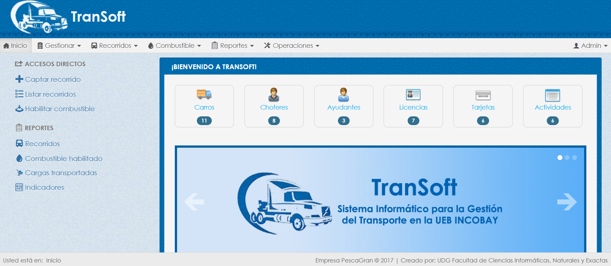
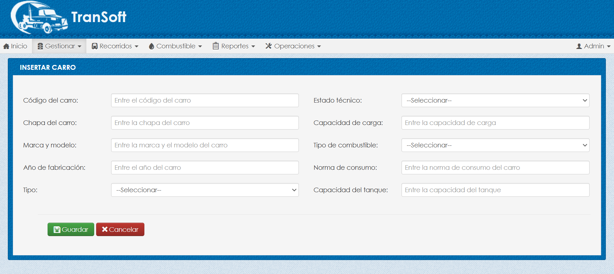
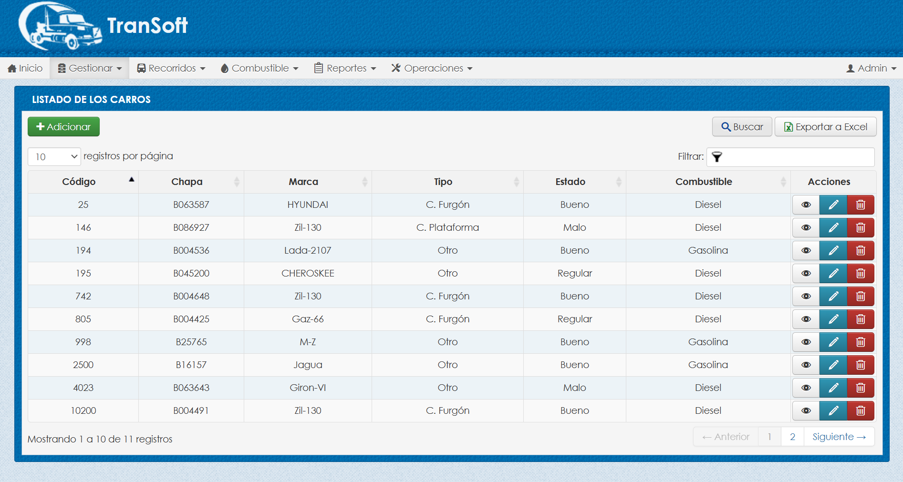
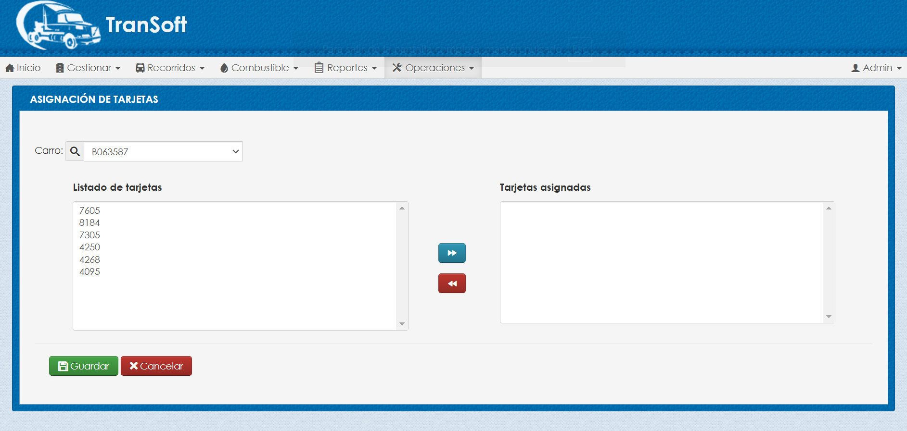
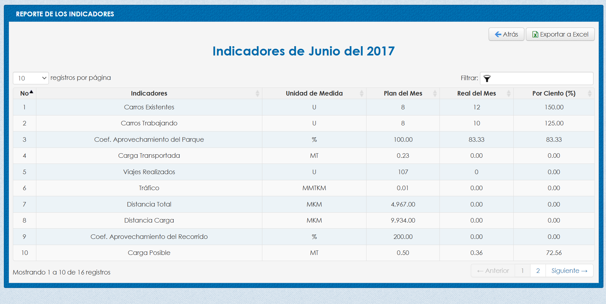

# TranSoft

Sistema desarrollado en **CodeIgniter 3.0.6**, como parte del proyecto de tesis de la carrera de Ingeniería en Ciencias Informáticas. Está diseñado para gestionar y organizar información relacionada con el transporte en la UEB Incobay de la empresa PescaGran en la provincia Granma, Cuba. Permite a las empresas registrar, monitorear y consultar datos clave como vehículos, choferes, ayudantes, licencias, tarjetas de combustible, actividades, recorridos y combustible, optimizando sus operaciones logísticas.

---

## Tecnologías

- **CodeIgniter 3.0.6**
- **Bootstrap v2.3.2**
- **jQuery 1.9.1**

---

## Instalación y ejecución

1. Clona este repositorio en tu máquina local `https://github.com/fhidalgorosabal/transoft.git`.
2. Asegúrate de tener un servidor web configurado (por ejemplo, XAMPP o WAMP).
3. Es recomendable tener estas versiones instaladas (PHP 5.6.x, MySQL 5.6.x, phpMyAdmin 4.9.x).
4. Coloca el proyecto en la carpeta `htdocs`, `www` o su equivalente.
5. En la carpeta `db` se encuentra el script de la base de datos de prueba para cargarlo en `phpMyAdmin`.
6. Accede en el navedador a `http://localhost/transoft/`.
 
---   

## Capturas de pantalla

### Login

### Inicio

### Insertar carro

### Listado de los carros

### Asignación de tarjetas

### Reportes

---

## Autor

Desarrollado por: Fernando Hidalgo Rosabal.

---

## Licencia

Este proyecto está licenciado bajo la [Licencia MIT](https://opensource.org/licenses/MIT).

---